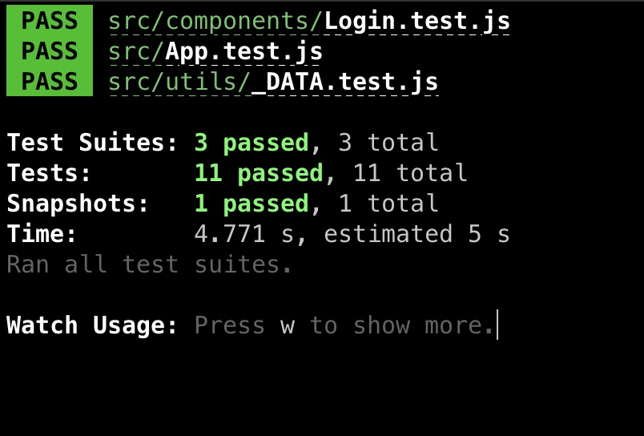

# Employee Polls

This is an application for employees to create polls. It has the following features-
* Login/Logout (username and password can be found in the `./src/utils/_DATA.js` file).
* View answered and unanswered polls.
* Create a new poll.
* Answer an existing poll.
* Leaderboard page.

## Installation

To install the dependencies of the project, we can run-
```
npm install
```
or
```
yarn
```

## Starting the application

To run the application, run-
```
npm start
```
or
```
yarn start
```

## Testing

To test the application, we can run-
```
npm test
```
or
```
yarn test
```

## Demo Link

The youtube demo can be found here- https://youtu.be/I1VgBwLnFh4

## Test Output-

The application has various tests like snapshot testing, input change testing, fake backend functions testing. The output of running these tests is-

